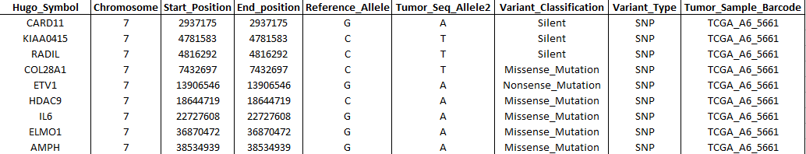
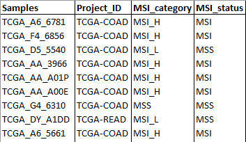
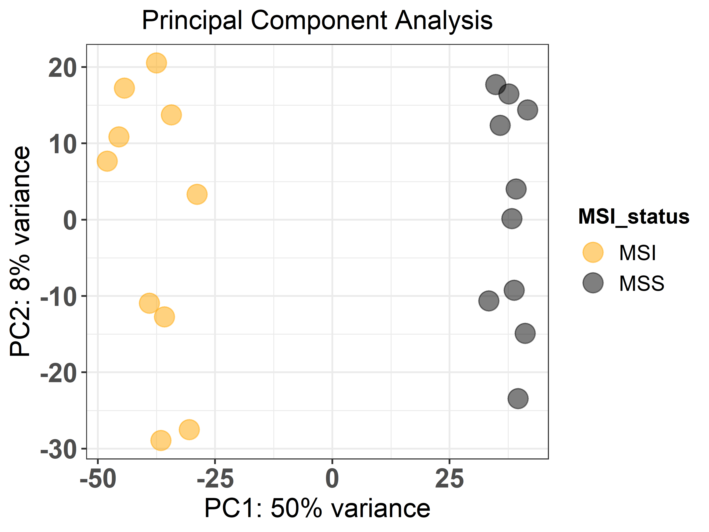
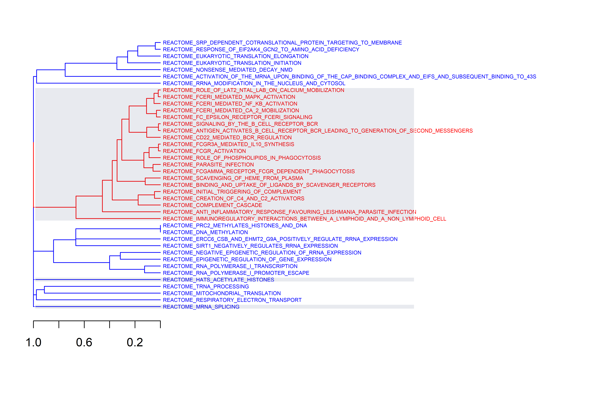

<!-- README.md is generated from README.Rmd. Please edit that file -->

# GEGVIC

<!-- badges: start -->
<!-- badges: end -->

GEGVIC is a workflow to analyse **G**ene **E**xpression, **G**enetic
**V**ariations and **I**mmune cell **C**omposition of tumour samples
using Next Generation Sequencing data. This is a common need in the
majority of the laboratories in the world, however, many times the high
variety of tools available to perform each individual task can confuse
and difficult the process.

Here we present an easy-to-use tool that requires few input files,
provides a good flexibility and produces appealing outputs when
comparing a group of samples for (i) *differential gene expression*,
(ii) *genetic variations* and (iii) *immune cell composition*.


## Installation

You can install the development version of `GEGVIC` from
[GitHub](https://github.com/oriolarques/GEGVIC) with:

``` r
# install.packages("devtools")
devtools::install_github("oriolarques/GEGVIC")
```

Since this package requires many dependencies, it is recommended to
execute the following code before the first usage to prepare the
environment correctly.

``` r
# CRAN packages 
if(!require(shiny)) install.packages("shiny")
if(!require(dplyr)) install.packages("dplyr")
if(!require(tibble)) install.packages("tibble")
if(!require(tidyr)) install.packages("tidyr")
if(!require(ggplot2)) install.packages("ggplot2")
if(!require(ggrepel)) install.packages("ggrepel")
if(!require(rlang)) install.packages("rlang")
if(!require(ggplotify)) install.packages("ggplotify")
if(!require(ggpubr)) install.packages("ggpubr")
if(!require(patchwork)) install.packages("patchwork")
if(!require(pheatmap)) install.packages("pheatmap")
if(!require(devtools)) install.packages("devtools")
if(!require(remotes)) install.packages("remotes")
if(!require(DT)) install.packages("DT")
if(!require(shinyFiles)) install.packages("shinyFiles")
if(!require(shinythemes)) install.packages("shinythemes")
if(!require(tm)) install.packages("tm")

# Bioconductor packages
if (!requireNamespace("BiocManager", quietly = TRUE)) install.packages("BiocManager")
if(!require(DESeq2)) BiocManager::install("DESeq2")
if(!require(apeglm)) BiocManager::install("apeglm")
if(!require(maftools)) BiocManager::install("maftools")
if(!require(clusterProfiler)) BiocManager::install("clusterProfiler")
if(!require(GSEAmining)) BiocManager::install("GSEAmining")
if(!require(BSgenome.Hsapiens.UCSC.hg19)) BiocManager::install("BSgenome")
if(!require(BSgenome.Hsapiens.UCSC.hg19)) BiocManager::install("BSgenome.Hsapiens.UCSC.hg19")
if(!require(BSgenome.Hsapiens.UCSC.hg19)) BiocManager::install("BSgenome.Hsapiens.UCSC.hg38")
if(!require(BSgenome.Hsapiens.UCSC.hg19)) BiocManager::install("BSgenome.Mmusculus.UCSC.mm10")
if(!require(BSgenome.Hsapiens.UCSC.hg19)) BiocManager::install("BSgenome.Mmusculus.UCSC.mm39")


# Github packages
remotes::install_github("icbi-lab/immunedeconv")
devtools::install_github('raerose01/deconstructSigs')
devtools::install_github("oriolarques/GEGVIC")
```

## Input data format

GEGVIC requires three main input data:

1.  **RNA-sequencing raw counts (Counts)**: Table containing raw gene
    counts as rows and samples as columns. The first column must contain
    gene identifiers that can be either *NCBI ID*, *ENSEMBL gene ID* or
    *HGNC ID* and its column name MUST be adequately named as either:
    **entrezgene_id, ensembl_gene_id or hgnc_symbol** respectively.


2.  **Genetic variations data (Muts)**: Table containing short variant
    calls. Necessary columns MUST have the following names (following
    the [MAF
    format](https://docs.gdc.cancer.gov/Data/File_Formats/MAF_Format/)):
    -   Hugo_Symbol: Gene symbol from HGNC.
    -   Chromosome: Affected chromosome.
    -   Start_Position: Mutation start coordinate.
    -   End_Position: Mutation end coordinate.
    -   Reference_Allele: The plus strand reference allele at this
        position. Includes the deleted sequence for a deletion or “-”
        for an insertion.
    -   Tumor_Seq_Allele2: Tumor sequencing discovery allele.
    -   Variant_Classification: Translational effect of variant allele.
        Can be one of the following: Frame_Shift_Del, Frame_Shift_Ins,
        In_Frame_Del, In_Frame_Ins, Missense_Mutation,
        Nonsense_Mutation, Silent, Splice_Site, Translation_Start_Site,
        Nonstop_Mutation, RNA, Targeted_Region.
    -   Variant_type: Type of mutation. Can be: ‘SNP’ (Single nucleotide
        polymorphism), ‘DNP’ (Double nucleotide polymorphism), ‘INS’
        (Insertion), ‘DEL’ (Deletion).
    -   Tumor_Sample_Barcode: Sample name.



3.  **Samples metadata**: Table that contains additional information to
    the samples to create groups such as response to a therapy. The
    first column MUST be named **Samples** and contain the same
    nomenclature for each sample as in the *RNA-sequencing raw counts*
    and *Genetic variations data tables*.



## Example of usage

Here, we will explore the workflow, how to use each function and the
outputs that they generate. Users can use their own data (with the
appropriate format as indicated before) by loading them in the R
workspace, however, the package comes with pre-loaded input data from
the article Riaz et al. ready to use and it is this one that will be
used to show the functionalities of the package.

*Reference: Riaz N, Havel JJ, Makarov V, Desrichard A, Urba WJ, Sims JS,
et al. Tumor and Microenvironment Evolution during Immunotherapy with
Nivolumab. Cell. 2017;171(4):934-949.e15. *

*Notes:*

-   *All the functions names have a prefix that indicate to which module
    they belong.*
-   *For further information about specific function argument, install
    the GEGVIC package and use the help function or visit the
    description page for the corresponding function in the GitHub
    respository under the ‘R/’ section.*

``` r
# load the package
library(GEGVIC)
```

### 1. Gene Expression module (GE)

This module uses the functionalities provided by the `DESeq2`
[package](https://bioconductor.org/packages/release/bioc/html/DESeq2.html).

#### 1.1. PCA

First, using the **ge_pca()** function we can perform a PCA to evaluate
how samples and groups relate to each other. For that, we indicate the
raw counts file (*input_ge_module*), how the gene identifiers are
encoded (‘*entrezgene_id*’), the metadata file (metadata_ge_module) and
the **unquoted name of the column** that contains the groups of interest
as the response argument. Then, the design should be a formula that
expresses how the counts for each gene depend on the variables in the
metadata, and finally the colours to represent each sample group. The
function outputs a plot.

``` r
ge_pca(counts = input_ge_module,
       genes_id = 'entrezgene_id',
       metadata = metadata_ge_module,
       response = Response,
       design = 'Response',
       colors = c('black', 'orange'))
```



#### 1.2. Differential gene expression

Then, we can compute differential gene expression between groups of
interest using the **ge_diff_exp()** function and store the results in
an object (**results.dds**).

We need to define new parameters such as the samples group that will be
used as the level of reference (the group to which the others will be
compared against in a form of a vector) and the shrinkage method of the
log2 fold changes to be applied (or not).

**In the case there are multiple levels of comparison the object will be
in a form of a list.**

``` r
results.dds <- ge_diff_exp(counts = input_ge_module,
                           genes_id = 'entrezgene_id',
                           metadata = metadata_ge_module,
                           design = 'Response',
                           ref_level = c('Response', 'Non_Responders'),
                           shrink = 'apeglm')
```

#### 1.3. Gene annotation

In the case that the gene identifiers provided are not in form of HGNC
symbols but are NCBI or ENSEMBL ID, we have to use the **ge_annot()**
function to perform the appropriate conversion and store the results in
a new object (**annot.res**). For that we will have to indicate a query
from the `biomart`
[package](https://bioconductor.org/packages/release/bioc/html/biomaRt.html)
with the following attributes: ensembl_gene_id, hgnc_symbol,
entrezgene_id, transcript_length, refseq_mrna. GEGVIC has already
available the following databases:

-   Genome Reference Consortium Human Build 37:
    *ensembl_biomart_GRCh37*.

-   Genome Reference Consortium Human Build 38:
    *ensembl_biomart_GRCh38_p13*.

-   Genome Reference Consortium Mouse Build 38 (mm10):
    *ensembl_biomart_GRCm38_p6*.

-   Genome Reference Consortium Mouse Build 39 (mm39):
    *ensembl_biomart_GRCm39*.

``` r
 annot.res <- ge_annot(results_dds = results.dds,
                          genes_id = 'entrezgene_id',
                          biomart = ensembl_biomart_GRCh38_p13)
```

#### 1.4. Volcano plot

To represent differential gene expression in form of Volcano plots the
function **ge_volcano()** is used to generate a plot for each comparison
groups. In the plot, the top ten most significantly up- and dw-regulated
genes will be highlighted. Furthermore, the function allow users to
define the fold change and adjusted p-value to further customize the
plot.

``` r
ge_volcano(annot_res = annot.res, 
           fold_change = 2, 
           p.adj = 0.05)
```


#### 1.5. GSEA: Gene Set Enrichment Analysis

One of the last functions of the module, **ge_gsea()**, permits to
perform Gene Set Enrichment Analysis (GSEA) using the `clusterProfiler`
[package](https://bioconductor.org/packages/release/bioc/html/clusterProfiler.html)
functionalities. The resulting top 20 regulated gene sets are shown in a
bubble plot where Normalized Enrichment Score (NES) is shown. The size
of the bubbles are determined by the percentage of genes in the gene set
that belong to the leading edge (core). Then, the same gene sets are
grouped by similarity and plotted using the `GSEAmining`
[package](https://bioconductor.org/packages/release/bioc/html/GSEAmining.html).
Three plots are generated, first a cluster of gene sets and, per each
cluster, a wordcloud of biological terms enriched in each case and the
top 3 genes in the leading edge of the different gene sets present in
that cluster.

To use this function the user has to provide a collection of gene sets
to evaluate in a form of a *gmt file*. This can be downloaded from the
Molecular Signatures Database,
[MSigDB](http://www.gsea-msigdb.org/gsea/downloads.jsp) or be customly
created following the corresponding \[guidelines\]
(<https://software.broadinstitute.org/cancer/software/gsea/wiki/index.php/Data_formats>).
In the case of working with mouse data gmt files can be found
[here](https://bioinf.wehi.edu.au/MSigDB/). The *C7: Immunologic
signature gene sets* was downloaded (**c7.all.v7.2.symbols.gmt** file)
and used to create this example.

Additionally, users can define the adjusted p-value cut-off to be more
or less restrictive when performing GSEA. The function generates two
plots, one dendrogram and one wordcloud with the most enriched name
terms in each cluster in the dendrogram.

*Note: There are two ways to access to the results table. (1) Call the
object results object as <gsea.res$table_name@result> or (2)
as.data.frame(gsea.res)*.

``` r
gsea.res <- ge_gsea(annot_res = annot.res,
                    gmt = 'inst/extdata/c7.all.v7.2.symbols.gmt',
                    gsea_pvalue = 0.2)
```





Finally, the **ge_single()** allows to perform Gene Set Variation
Analysis (GSVA) or single sample GSEA (ssGSEA) to cluster samples using
the `GSVA`
[package](https://bioconductor.org/packages/release/bioc/html/GSVA.html).
In order to do that, the user has to define the method and also indicate
the gene set collection of interest. By default, the `HALLMARK`
collection from the MSigDB will be used if the location of a different
.gmt file is not provided.

Results are shown as a heatmap. Users can define the color of the sample
groups and also if gene set names and/or sample names should be plotted
or not.

``` r
gsva.res <- ge_single(counts = input_ge_module,
                      metadata = metadata_ge_module,
                      genes_id = 'entrezgene_id',
                      response = Response,
                      design = 'Response',
                      biomart = ensembl_biomart_GRCh38_p13,
                      gsva_gmt = 'hallmark',
                      method = 'gsva',
                      colors = c('black', 'orange'),
                      row.names = TRUE,
                      col.names = TRUE)
```


### 2. Genetic Variations module (GV)

This module uses functionalities from the `maftools`
[package](https://bioconductor.org/packages/release/bioc/html/maftools.html)
and the `deconstructSigs`
[package](https://github.com/raerose01/deconstructSigs).

#### 2.1. Mutational summary

The genetic variations input (*input_gv_module*) together with samples
metadata can be used in the function **gv_mut_summary()** to generate
two plots that will first summarise the mutation types present in the
samples and second highlight the most common mutations by groups in a
form of an oncoplot. Users **MUST** indicate the **unquoted name** of
the column that contains the groups of interest in the response
argument. Additionally, the number and which genes will appear in the
oncoplot and the colours of sample groups can be modified.

``` r
gv_mut_summary(muts = input_gv_module,
               metadata = metadata_ge_module,
               response = Response,
               top_genes = 10,
               specific_genes = NULL,
               colors = c('black', 'orange'))
```


#### 2.4. Mutational load

The function **gv_mut_load()** will calculate the total number of
mutations per sample. The same inputs as the previous function are
required. Also the compare and p_label arguments allow users to decide
which method should be used for comparing means and the way the
significance is represented. As usual, the function allows to change
also the colours of the groups.

``` r
mut.load <- gv_mut_load(muts = input_gv_module,
                        metadata = metadata_ge_module,
                        response = Response,
                        compare = 'wilcox.test',
                        p_label = 'p.format',
                        colors = c('black', 'orange'))
```


#### 2.5. Mutational signatures

The last function of the package, **gv_mut_signatures()** is used to
predict the weight of mutational signatures contributing to an
individual tumour sample. As well as the inputs described before, here
the user have to choose the version of the genome to work with. To do
so, the gbuild argument should be one of the following:

-   ‘BSgenome.Hsapiens.UCSC.hg19’

-   ‘BSgenome.Hsapiens.UCSC.hg38’

-   ‘BSgenome.Mmusculus.UCSC.mm10’

-   ‘BSgenome.Mmusculus.UCSC.mm39’ for mouse data.

Also, the mutational signature matrices containing the frequencies of
all nucleotide changes per signature need to be indicated. GEGVIC
contains the matrices from
[COSMIC](https://cancer.sanger.ac.uk/signatures/downloads/) for single
and double base substitutions. To choose one, the user has to indicate
’COSMIC_v{XX}\_{YY}BS_GRCh{ZZ}’ in the mut_sigs argument. The **XX** is
the version, that can be v2 or v3.2. **YY** indicates if mutations are
single (S) or double (D) base substitutions, while the **ZZ** is for the
genome assembly, either GRCh37 or GRCh38 for human data and mm9 or mm10
for mouse data.

The function generates two plots. The first is a barplot that shows the
weight of the top four mutational signatures per sample and group. Since
depending on how many samples or signatures are present in the analysis
the results may be difficult to interpret, a second plot is generated.
This is a heatmap that shows all samples as columns and signatures as
rows and the weight of each signature determines the intensity of the
colour. We believe that, although the first plot is more common in the
literature, the second plot can be helpful, especially when many
mutational signatures are present in many samples.

``` r
mut.sigs <- gv_mut_signatures(muts = input_gv_module,
                              metadata = metadata_ge_module,
                              response = Response,
                              gbuild = 'BSgenome.Hsapiens.UCSC.hg19',
                              mut_sigs = 'COSMIC_v2_SBS_GRCh37',
                              tri.counts.method = 'default',
                              colors = c('black', 'orange'))
```


### 3. Immune cell Composition module (IC)

This module uses functionalities from the `immunedeconv`
[package](https://github.com/icbi-lab/immunedeconv).

#### 3.1 Transform raw counts to TPM

To predict immune composition of tumour microenvironment from
RNA-sequencing data, we need first to transform raw counts to TPM
(Transcript Per kilobase Million), as it is required by all the methods
in the `immunedeconv` package. The function *ic_raw_to_tpm()* takes the
same input as for the GE_module (RNA-seq raw counts). It also needs the
gene identifiers encoding and the biomaRt database. The results should
be stored as a new object (**tmp**).

``` r
tpm <- ic_raw_to_tpm(counts = input_ge_module,
                     genes_id = 'entrezgene_id',
                     biomart = ensembl_biomart_GRCh38_p13)
```

#### 3.2. Predict immune cell composition

The object containing TPM reads will be used as the input for the
**ic_deconv()** function, which estimates the immune cell composition of
the samples. All the following methods (included in the `immunedeconv`
package) QUANTISEQ, TIMER, MCP_COUNTER, XCELL, EPIC and CIBERSORT will
be used.

*Note: To use the CIBERSORT, the user need to register on the CIBERSORT
web page (<https://cibersort.stanford.edu>), obtain a license and
download the source code in form of two files CIBERSORT.R and LM22.txt.
Then, the user need to specify the path to the storage location of such
files in the cibersort argument.*

The indications argument must be a character vector of cancer type codes
for each sample in the tpm matrix. Indications supported can be checked
using immunedeconv::timer_available_cancers. Results should be saved in
a new object (**ic.pred**).

``` r
ic.pred <- ic_deconv(gene_expression = tpm,
                     indications = rep('skcm', ncol(tpm)),
                     cibersort = 'cibersort/',
                     tumor = TRUE,
                     rmgenes = NULL,
                     scale_mrna = TRUE,
                     expected_cell_types = NULL)
```

#### 3.3. Plot cell predictions

With the **ic_plot_comp_samples()** function we can plot a graph
comparing each immune cell populations between sample groups per method.
For that, the name of column where lies the grouping variable must be
written **WITHOUT** quotes in the response argument. The compare
argument allow users to decide which method should be used for comparing
means. Options are ‘t.test’ and ‘wilcox.test’ for two groups or ‘anova’
and ‘kruskal.test’ for more groups. Also, the p_label argument permits
to choose the way the significance is represented, being either
‘p.signif’ (shows the significance levels) or ‘p.format’ (shows the
formatted p-value). The function allows to change also the colours of
the groups.

``` r
ic_plot_comp_samples(df = ic.pred,
                     metadata = metadata_ge_module,
                     response = Response,
                     compare = 'wilcox.test',
                     p_label = 'p.format',
                     colors = c('black', 'orange'))
```


Similarly, the **ic_plot_comp_celltypes()** function is able to plot the
comparison of each immune cell fraction within each sample from the
predictions made by CIBERSORT, EPIC and QUANTISEQ.

``` r
ic_plot_comp_celltypes(df = ic.pred,
                       metadata = metadata_ge_module,
                       response = Response)
```


#### 3.4. Calculate Immunophenogram and Immunophenoscores

The last function in this module, **ic_score()** uses TPM expression
values to calculate and plot immunophenogram (IPG) and immunophenoscores
(IPS) for each sample and each group of study. They give an overall
picture of the state of MHC molecules (MHC), Immunomodulators (CP),
Effector cells (EC) and Suppressor cells (SC) in each sample, making
possible the comparison between samples. For further interpretation
please visit <https://tcia.at/tools/toolsMain>.

``` r
ips <- ic_score(tpm = tpm,
                metadata = metadata_ge_module,
                response = Response,
                compare = 'wilcox.test',
                p_label = 'p.format',
                colors = c('black', 'orange'))
```


